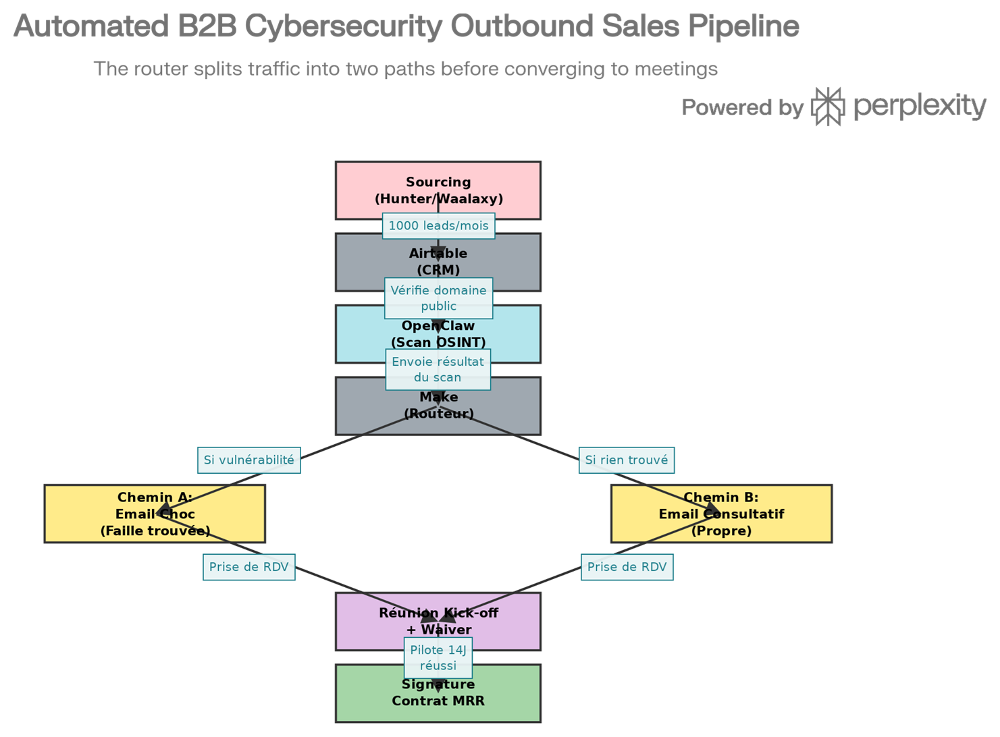

---
title: "Stratégie d'Entreprise & Machine d'Acquisition B2B"
author: "SKYNET CONSULTING"
---

    <h1>SKYNET CONSULTING</h1>
    <h2>Stratégie d'Entreprise & Machine d'Acquisition B2B</h2>

## TABLE DES MATIÈRES

1. **Synthèse Exécutive**
2. **Positionnement Stratégique**
3. **Le "Trust Gap" et sa Solution Juridique**
4. **La Machine d'Acquisition Automatisée**
5. **Le Tunnel de Conversion**
6. **Modèle Économique & Objectifs**
7. **Roadmap 180 Jours**

---

## 1. SYNTHÈSE EXÉCUTIVE

### La Promesse Skynet Consulting

Skynet Consulting est une société de services cybersécurité B2B qui génère du revenu récurrent (MRR) à travers trois offres verticales :

<ul>
<li><strong>SOC Managé</strong> (Détection 24/7 avec OpenSearch + Wazuh + TheHive)</li>
<li><strong>Audits Sécurité</strong> (ISO 27002, Cloud Security)</li>
<li><strong>Optimisation Cloud</strong> (FinOps + CSPM avec Prowler)</li>
</ul>

### Le Modèle Différenciant

Contrairement aux ESN traditionnelles, Skynet ne vend pas du "temps homme" au prix fort. Elle vend des **résultats sécurisés** en utilisant une architecture hybride :

<ul>
<li><strong>L'IA OpenClaw</strong> effectue 80% du travail (triage, enrichissement, rédaction)</li>
<li><strong>Un seul ingénieur senior (Nabil)</strong> dirige l'opération</li>
<li><strong>Des freelances juniors</strong> exécutent sur site, guidés par l'IA</li>
<li><strong>Des analystes offshore 3x8</strong> assurent la surveillance nocturne</li>
</ul>

<strong>Résultat :</strong> Marges brutes 75%+, scalabilité infinie, réduction des coûts de 70%.

### L'Objectif à 6 Mois (Horizon Mars 2026)

| Métrique | Cible |
|----------|-------|
| **Clients Récurrents** | 12-15 clients |
| **MRR (Monthly Recurring Revenue)** | 18 000 $ - 22 500 $ |
| **Marge Brute** | 75%+ |
| **Équipe Skynet HQ** | 2 personnes (Ya Ha + Nabil) + support |

---

## 2. POSITIONNEMENT STRATÉGIQUE

### Qui Sont Nos Clients ?

<strong>Profil Type :</strong>
<ul>
<li>PME et ETI (100-2000 employés)</li>
<li>Secteurs régulés (Finance, Santé, E-commerce)</li>
<li>Zones géographiques : France, USA, Golfe (GCC)</li>
<li>DSI ou CISO ayant un budget cyber mais sans ressources internes</li>
</ul>

**Pourquoi Ils Nous Choisissent :**
1. Expertise senior à coût junior (grâce à l'IA)
2. Intervention rapide (2-3 semaines max)
3. Rapports transparents et actionables
4. Accompagnement sur la durée (SOC + suivi)

### Notre Avantage Concurrentiel

| Aspect | Nous | Les Concurrents |
|--------|------|-----------------|
| **Coût d'Exécution** | 30-40% du prix de vente | 50-60% (experts seniors sur site) |
| **Scalabilité** | Illimitée (10 missions parallèles) | Limitée (experts > 5 missions = risque) |
| **Conformité Données** | Régionalisée par juridiction | Centralisée (risque RGPD/HIPAA) |
| **Automatisation** | IA-First (80% du travail) | Manual (100% humain) |
| **Time-to-Value** | 2 semaines | 4-6 semaines |

### Les Trois Piliers Skynet

    

        
PILIER 1: Efficacité Opérationnelle

        <ul class="tree-items">
            <li>OpenClaw (IA centrale)</li>
            <li>Freelances juniors scalables</li>
            <li>Analystes offshore 3x8</li>
        </ul>
    

    

        
PILIER 2: Souveraineté & Confiance

        <ul class="tree-items">
            <li>LLC/SASU locale (façade légale)</li>
            <li>Hébergement régionalisé (UE/US)</li>
            <li>Waiver de responsabilité</li>
        </ul>
    

    

        
PILIER 3: Acquisition Agressive

        <ul class="tree-items">
            <li>Prospection automatisée (Hunter/Make)</li>
            <li>Tunnels conditionnels (Alerte vs Consultatif)</li>
            <li>Conversion commando (14 jours)</li>
        </ul>
    

## 3. LE "TRUST GAP" ET SA SOLUTION JURIDIQUE

### Le Problème : Pourquoi "Algérie" = Friction

Une PME française reçoit un email : *"Bonjour, on fait de la cybersécurité depuis l'Algérie."*

<strong>Réactions immédiates :</strong>
<ol>
<li>"Vont-ils respecter le RGPD ?"</li>
<li>"Qui va signer le contrat ? Quelle juridiction ?"</li>
<li>"Et si ça plante ? Qui paie ?"</li>
<li>"L'assurance cyber couvre l'Afrique du Nord ?"</li>
</ol>
<strong>Résultat :</strong> Email ignoré → Pas de réponse → Pas de vente.

### La Solution : L'Ingénierie Juridique de Skynet

<strong>Étape 1 : La Façade Légale (LLC ou SASU)</strong> 
Création d'une entité légale locale dans le pays cible (SASU en France, LLC aux USA). Les contrats sont signés sous juridiction reconnue, l'assurance cyber accepte Skynet, et les paiements passent facilement.

<strong>Étape 2 : Souveraineté Absolue des Données</strong> 
Les logs des clients ne quittent jamais leur juridiction (Cluster AWS à Francfort pour l'UE, Virginie pour les USA). Aucun log n'est stocké en Algérie, garantissant la conformité RGPD/HIPAA.

<strong>Étape 3 : Le Waiver de Responsabilité (Bouclier Juridique)</strong> 
Avant toute intervention, le client signe une décharge électronique stipulant que Skynet n'est pas responsable des failles préexistantes ou des arrêts de production.

---

## 4. LA MACHINE D'ACQUISITION AUTOMATISÉE

### Vue d'Ensemble du Workflow

La prospection Skynet est une **chaîne d'assemblage asynchrone** gérée par 4 outils : Hunter/Waalaxy (Extraction), Airtable (Base de données), OpenClaw (Scan OSINT), et Make (Automatisation).

    
    
Architecture de la machine d'acquisition automatisée Skynet

### Étape 1 : Sourcing Massif (1000 leads/mois)

**Outil :** Hunter + Waalaxy

<strong>Action :</strong>
<ol>
<li>Recherche par critères : "Directeur IT" + "PME 200-2000 emp" + "France" + "Secteur Finance"</li>
<li>Extraction : Liste de 500 contacts qualifiés → Email + LinkedIn + Téléphone</li>
<li>Import dans Airtable : Chaque contact = 1 ligne avec des champs standardisés</li>
</ol>

### Étape 2 : Le Scan OSINT Intelligent (OpenClaw)

**Outil :** OpenClaw (Scripts autonomes en bac à sable)

Avant qu'un email ne soit envoyé, OpenClaw effectue un scan OSINT **silencieux et non intrusif** du domaine public du prospect en exécutant ses propres scripts de reconnaissance.

<strong>Ce qu'elle cherche :</strong>
<ul>
<li>Certificats SSL expirés → Désinvolture IT</li>
<li>Ports distants ouverts (RDP/SSH) → Vulnérabilité critique</li>
<li>Base de données MongoDB/Elasticsearch non protégées → Data Leak risk</li>
<li>Identifiants compromis sur Dark Web → Breach antérieur</li>
</ul>

### Étape 3 : Le Routeur Conditionnel (Make)

**Outil :** Make (Zapier-like)

<strong>Tunnel A : L'Email "Alerte Rouge" (Urgence)</strong> 
Déclenché si au moins 1 vulnérabilité critique est trouvée. L'email frappe fort : <em>"Notre SOC a détecté le port RDP ouvert sur votre domaine. Le mois dernier, une PME de votre secteur a subi un ransomware en 48h à cause de cela."</em> (Taux de réponse attendu : 8-12%)

<strong>Tunnel B : L'Email "Consultatif" (Soft Touch)</strong> 
Déclenché si aucune vulnérabilité n'est trouvée. L'approche pivote sur la menace interne : <em>"Votre périmètre externe est propre. Cependant, 80% des attaques proviennent de l'interne. Pouvez-vous détecter une attaque interne en moins de 2 heures ?"</em> (Taux de réponse attendu : 3-5%)

## 5. LE TUNNEL DE CONVERSION

<strong>Phase 1 : Qualification Brutale (Appel 5 min)</strong> 
Objectif : Éliminer les prospects sans budget ou sans autorité. 60% des prospects sont éliminés ici. C'est normal et efficace.

<strong>Phase 2 : Le Pilote Commando (14 Jours)</strong> 
La période d'essai ne dure que deux semaines pour forcer l'urgence. Le déploiement s'effectue via une réunion technique (30 minutes) où le DSI installe lui-même l'agent Wazuh.

<strong>Phase 3 : Le Daily Flash (Preuve de Valeur)</strong> 
Pendant 14 jours, le client reçoit un mini-rapport automatisé généré par OpenClaw prouvant la valeur de l'analyse en temps réel (alertes critiques bloquées, surveillance).

<strong>Phase 4 : La Signature MRR (Conversion)</strong> 
Jour 12 : Appel de clôture. L'infrastructure est déjà en place, les alertes fonctionnent, la conversion du Pilote en contrat mensuel récurrent s'opère naturellement pour éviter la coupure du service.

---

## 6. MODÈLE ÉCONOMIQUE & OBJECTIFS

### Composition des Revenus MRR

Skynet génère du revenu récurrent via **trois flux distincts** :

<strong>Flux 1 : SOC Managé (50% du MRR cible)</strong>
<ul>
<li>Nombre de clients SOC : 8-10</li>
<li>Prix moyen/client : 1500 $ - 2500 $ / mois</li>
<li>MRR SOC : 12 000 $ - 25 000 $</li>
</ul>

<strong>Flux 2 : Audits Ponctuels (30% du MRR cible)</strong>
<ul>
<li>Audits/mois : 2-3 missions</li>
<li>Prix moyen : 3000 $ - 8000 $ par audit</li>
<li>Revenu mensuel : 6 000 $ - 24 000 $</li>
</ul>

<strong>Flux 3 : FinOps Cloud & Consulting (20% du MRR cible)</strong>
<ul>
<li>Success Fees (FinOps) : 50% des économies réalisées</li>
<li>Audits Cloud : 2000 $ - 5000 $ par mission</li>
<li>Revenue/mois : 3000 $ - 5000 $</li>
</ul>

### Structure de Coûts (Marges)

    

        
Revenu MRR Client : 2000 $ (contrat SOC 1 client moyen)

    

    

        
COÛTS DIRECTS (500 $)

        <ul class="tree-items">
            <li>Freelance : 150 $ (intégration + support)</li>
            <li>Infrastructure Cloud (AWS) : 200 $ (cluster + stockage logs)</li>
            <li>Outils (Wazuh/OpenSearch licences) : 100 $</li>
            <li>Contingency (5%) : 50 $</li>
        </ul>
    

    

        
MARGE BRUTE = 1500 $ (75%)

    

    

        
COÛTS FIXES = 3800 $/mois

        <ul class="tree-items">
            <li>Salaire Nabil : ~2000 $/mois (réparti sur 10 clients)</li>
            <li>Équipe Support (0.5 FTE) : ~1000 $/mois</li>
            <li>Marketing/Hunter : ~500 $/mois</li>
            <li>Juridique/Compliance : ~300 $/mois</li>
        </ul>
    

    
PROFIT NET (avec 10 clients MRR) : 15 000 $

    
10 clients × 1500 $ marge brute

    Document confidentiel - SKYNET CONSULTING © 2026

