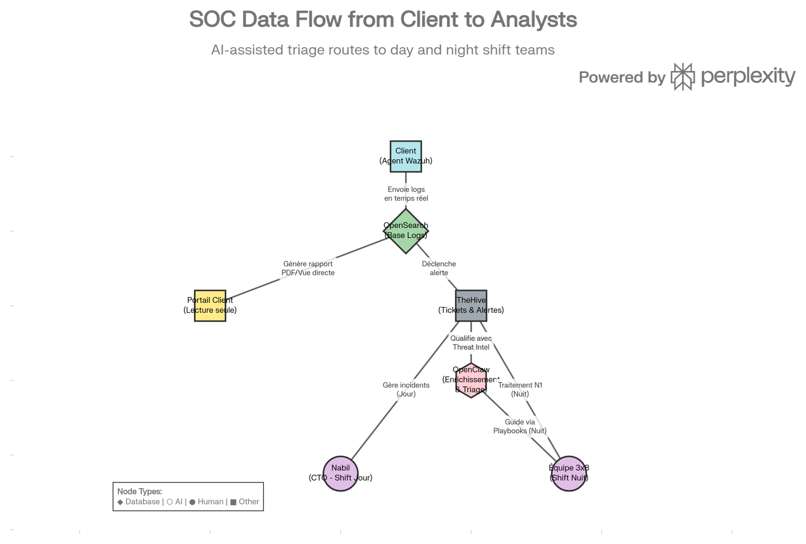

---
title: "Stratégie Opérationnelle SOC - MSSP"
author: "SKYNET CONSULTING"
---

    <h1>SKYNET CONSULTING</h1>
    <h2>Stratégie Opérationnelle SOC - Managed Security Service Provider</h2>

## TABLE DES MATIÈRES

1. **Synthèse Exécutive**
2. **Positionnement du SOC**
3. **Architecture Technique**
4. **Modèle Économique & Pricing**
5. **Organisation & Équipes**
6. **Onboarding & Pilote**
7. **Rétention & Fidélisation**
8. **SLA & Métriques de Performance**
9. **Roadmap Opérationnelle**

---

## 1. SYNTHÈSE EXÉCUTIVE

### La Promesse SOC Skynet

Skynet Consulting offre un **SOC Managé 24/7** (Managed Security Service Provider) conçu pour détecter et contenir les menaces en temps réel, sans surcharger les équipes IT du client.

<strong>Proposition de valeur :</strong>
<ul>
<li>Détection des menaces en <strong>moins de 2 heures</strong> (MTTD : Mean Time To Detect)</li>
<li>Couverture <strong>24/7/365</strong> avec équipes offshore 3x8</li>
<li><strong>Automatisation IA</strong> (OpenClaw) qui élimine 80% des fausses alertes</li>
<li>Transparence totale via portail client en temps réel</li>
<li><strong>Marges brutes 75%+</strong> grâce à la scalabilité de l'architecture</li>
</ul>

### L'Architecture en 4 Briques

| Brique | Rôle | Outil |
|--------|------|------|
| **Collecte** | Agents légers chez le client | **Wazuh Agent** |
| **Stockage & Visualisation** | Base de logs centralisée | **OpenSearch** |
| **Gestion d'Incidents** | Ticketing des alertes | **TheHive** |
| **Intelligence Artificielle** | Triage, enrichissement, remédiation | **OpenClaw** |

### Objectifs SOC à 6 Mois (Mars 2026)

| Métrique | Cible |
|----------|-------|
| **Clients SOC Actifs** | 8-12 |
| **MRR SOC** | 12 000 $ - 25 000 $ |
| **Marge Brute** | 75%+ |
| **Taux de Rétention** | 90%+ |
| **MTTD (Mean Time To Detect)** | < 2 heures |
| **Disponibilité Infrastructure** | 99.9% |

---

## 2. POSITIONNEMENT DU SOC

### Qui Sont Nos Clients SOC ?

<strong>Profil Type :</strong>
<ul>
<li>PME et ETI (100-2000 employés)</li>
<li>Secteurs régulés : Finance, Santé, E-commerce, Énergie</li>
<li>DSI/CISO ayant un budget cyber mais <strong>SANS</strong> équipe de détection interne</li>
<li>Zones géographiques : France, USA, Golfe (GCC)</li>
</ul>

**Pourquoi Ils Choisissent Notre SOC :**
1. **Expertise 24/7 en continu** (pas juste un outil, une équipe)
2. **Coût prévisible et scalable** (facturation par Go de logs)
3. **Zéro maintenance technique** (on gère l'infrastructure pour eux)
4. **Conformité garantie** (RGPD, HIPAA, SOC2, ISO 27001)

### Le Problème du Marché

    

        
AVANT SKYNET

    

    

        
Option 1 : Embaucher un CISO interne

        <ul class="tree-items">
            <li>Coût : 60 000 € - 80 000 € / an</li>
            <li>Risque : 1 personne = goulot d'étranglement</li>
            <li>Scalabilité : Aucune</li>
        </ul>
    

    

        
Option 2 : Acheter un outil SIEM (Splunk, ELK)

        <ul class="tree-items">
            <li>Coût infrastructure : 20 000 € - 50 000 € / an</li>
            <li>Coût maintenance : 30 000 € - 60 000 € / an</li>
            <li>Risque : Fausses alertes massives (95% non-exploitables)</li>
            <li>Scalabilité : Limitée à la capacité serveur</li>
        </ul>
    

    

        
Option 3 : SOC traditionnel (Mandiant, CrowdStrike)

        <ul class="tree-items">
            <li>Coût : 100 000 € + / an (prohibitif pour PME)</li>
            <li>Lock-in : Contrats 3-5 ans, très rigides</li>
        </ul>
    

    

        
APRÈS SKYNET

    

    

        
SOC Managé Skynet

        <ul class="tree-items">
            <li>Coût : 1 500 $ - 2 500 $ / mois (PME peut le justifier)</li>
            <li>Humain + IA : 100% du travail qualifié</li>
            <li>Scalabilité : Illimitée (50 clients parallèles, 2 personnes HQ)</li>
            <li>Expertise : Senior (Nabil) + Analystes certifiés</li>
            <li>Sortie facile : Pas de lock-in long terme</li>
        </ul>
    

## 3. ARCHITECTURE TECHNIQUE

### Le Workflow de Détection

    
    
Architecture Technique du SOC Skynet

<strong>Étape 1 : Collecte (Wazuh)</strong> 
L'agent Wazuh est déployé sur les serveurs, postes de travail et environnements cloud du client. Il collecte les logs système, les événements de sécurité, et surveille l'intégrité des fichiers (FIM).

<strong>Étape 2 : Stockage & Analyse (OpenSearch)</strong> 
Les logs sont envoyés de manière sécurisée vers notre cluster OpenSearch (hébergé dans la juridiction du client). OpenSearch indexe les données et applique des règles de détection (Sigma, YARA) pour identifier les comportements anormaux.

<strong>Étape 3 : Gestion d'Incidents (TheHive)</strong> 
Lorsqu'une règle est déclenchée, une alerte est envoyée à TheHive. TheHive crée un ticket d'incident structuré, prêt à être analysé.

<strong>Étape 4 : Triage IA (OpenClaw)</strong> 
C'est ici que la magie opère. OpenClaw intercepte le ticket TheHive <em>avant</em> qu'un humain ne le voie.
<ul>
<li>Il enrichit l'alerte avec des flux de Threat Intelligence (AbuseIPDB, VirusTotal).</li>
<li>Il analyse le contexte (ex: "Est-ce un comportement normal pour cet utilisateur ?").</li>
<li>Il clôture automatiquement les faux positifs (80% des alertes).</li>
<li>Il escalade les vraies menaces à l'équipe humaine avec un résumé clair et des recommandations d'action.</li>
</ul>

---

## 4. MODÈLE ÉCONOMIQUE & PRICING

### La Tarification au Volume (Forfait Annuel Lissé)

Le modèle de pricing s'affranchit du comptage par agents. Il est basé sur un forfait annuel pur de volume de logs, lissé sur 12 mensualités pour préserver la trésorerie du client.

<strong>Principe de Tarification :</strong> 
500 $ / Go de logs par an

**Exemple Pratique :**
1. Consommation évaluée : **3 Go / mois**.
2. Fixation annuelle : 36 Go / an (36 × 500$ = **18 000$**).
3. Facturation Mensuelle MRR : 18 000$ / 12 = **1 500 $ / mois**.

**Transparence & Gestion des Dépassements (Sécurité Confiance) :**
- **Seuil 85% :** Alerte proactive et appel cyber technique gratuit avec le DSI pour analyser la cause racine.
- **Seuil 100% :** Le client garde le contrôle complet de la décision :
  1. Achat d'extensions de Go supplémentaires (au même prix unitaire de 500$).
  2. Optimisation immédiate des logs (réduction saine de verbosité).
  3. Upgrade natif du contrat.
*Règle SOC Skynet : Aucune surfacturation cachée.*

### Structure de Coûts (Marges)

    

        
Revenu MRR Client Pro : 2500 $

    

    

        
COÛTS DIRECTS (Infrastructure & Outils) : 400 $

        <ul class="tree-items">
            <li>Cluster OpenSearch (AWS/Azure) : 250 $</li>
            <li>Serveur Wazuh Manager : 100 $</li>
            <li>Serveur TheHive : 50 $</li>
        </ul>
    

    

        
COÛTS DIRECTS (Humains) : 200 $

        <ul class="tree-items">
            <li>Analystes L1 (Offshore) : 150 $ (quote-part par client)</li>
            <li>Licences API (Threat Intel) : 50 $</li>
        </ul>
    

    

        
MARGE BRUTE = 1900 $ (76%)

    

## 5. ORGANISATION & ÉQUIPES

### L'Équipe Skynet (Le Modèle Hybride)

<strong>Niveau 1 (L1) : Le Triage Automatisé (OpenClaw)</strong>
<ul>
<li><strong>Rôle :</strong> Filtrer le bruit, enrichir les alertes, fermer les faux positifs.</li>
<li><strong>Disponibilité :</strong> 24/7, instantané.</li>
<li><strong>Coût :</strong> Quasi nul (coût de calcul IA).</li>
</ul>

<strong>Niveau 2 (L2) : L'Analyse Humaine (Offshore 3x8)</strong>
<ul>
<li><strong>Rôle :</strong> Analyser les alertes escaladées par l'IA, confirmer la menace, initier la réponse de base (ex: isoler une machine).</li>
<li><strong>Profil :</strong> Analystes SOC juniors/intermédiaires basés dans des zones à coût optimisé (ex: Maghreb, Asie).</li>
<li><strong>Disponibilité :</strong> 24/7 (rotation d'équipes).</li>
</ul>

<strong>Niveau 3 (L3) : L'Expertise Senior (Nabil)</strong>
<ul>
<li><strong>Rôle :</strong> Gérer les incidents critiques (Ransomware, APT), optimiser les règles de détection, relation client stratégique.</li>
<li><strong>Profil :</strong> Ingénieur Cybersécurité Senior (Toi).</li>
<li><strong>Disponibilité :</strong> Heures de bureau + Astreinte critique.</li>
</ul>

---

## 6. MÉTHODOLOGIE D'INTÉGRATION : LE PILOTE (3 SEMAINES)

### Prouver la valeur avant de s'engager
Plutôt que de vendre une promesse théorique à l'aveugle, Skynet Consulting déploie son SOC directement sur votre environnement pendant 21 jours. L'objectif est clair : démontrer mathématiquement notre capacité à détecter des incidents réels en moins de 2 heures, sans aucune perturbation pour vos services.

<strong>L'Onboarding Sans Friction (Zéro Lenteur) :</strong>
<ul>
<li>Au démarrage, nous fournissons un "Quickstart" technique de <strong>5 pages maximum</strong>.</li>
<li><strong>Le but :</strong> Éviter les manuels lourds de 50 pages, réduire toute friction au démarrage, et tuer les erreurs techniques avant même qu'elles n'apparaissent.</li>
</ul>

### Le Déroulé Structuré du Pilote

    

        
Jour 1 : L'Amorçage et l'Installation

        <ul class="tree-items">
            <li>Déploiement simple des agents Wazuh sur le parc informatique ciblé.</li>
            <li><strong>Obligation de résultat :</strong> Le SOC doit être opérationnel en moins de 24h avec rigoureusement <strong>0 downtime (aucune coupure)</strong> sur les services du client.</li>
        </ul>
    

    

        
Jours 2 à 3 : La Phase d'Apprentissage (Calibrage IA)

        <ul class="tree-items">
            <li>L'intelligence artificielle analyse le trafic pour mémoriser ce qui est un comportement "normal" dans l'entreprise (Baseline).</li>
            <li>Ajustement sur-mesure des règles de détection pour éliminer d'emblée tout bruit de fond.</li>
        </ul>
    

    

        
Jours 4 à 19 : Le Bouclier Actif (Surveillance 24/7)

        <ul class="tree-items">
            <li>Le SOC passe en statut défensif global. Les environnements sont monitorés nuit et jour.</li>
            <li>Envoi du Daily Flash quotidien et organisation d'appels hebdomadaires courts pour montrer la capture en temps réel.</li>
        </ul>
    

    

        
Jour 20 : Le Bilan Décisionnel Continu

        <ul class="tree-items">
            <li>Arrêt de la phase d'essai et restitution formelle des faits découverts. C'est l'étape de transition vers le contrat de maintenance complet.</li>
        </ul>
    

<strong>La Logique Stratégique du Bilan au J20 :</strong> 
La réunion du Jour 20 (Clôture) est purement factuelle et s'appuie sur la démonstration de la valeur :
<ul>
    <li><strong>Validation de menaces :</strong> <i>"Nous avons détecté <strong>X incidents réels</strong> sur votre réseau. Pour chacun d'entre eux, notre équipe a réagi en moins de 2 heures."</i></li>
    <li><strong>Gain de temps DSI :</strong> <i>"Notre système a bloqué et qualifié <strong>Y fausses alertes massives</strong>. Nous ne vous avons jamais dérangé pour rien."</i></li>
    <li><strong>Fiabilité technique :</strong> <i>"Le déploiement était complètement transparent."</i></li>
    <li><strong>Continuité :</strong> Signature du contrat final pour pérenniser ce cocon sécuritaire sous facturation lissée.</li>
</ul>

## 7. SLA & MÉTRIQUES DE PERFORMANCE

### Les Engagements Skynet (SLA)

Pour rassurer les clients, Skynet s'engage sur des métriques claires et mesurables :

| Métrique | Définition | Engagement Skynet |
|----------|------------|-------------------|
| **MTTD** | Mean Time To Detect (Temps moyen pour détecter une menace) | **< 2 heures** |
| **MTTA** | Mean Time To Acknowledge (Temps moyen pour qu'un analyste prenne en charge l'alerte) | **< 15 minutes** (Critique) |
| **MTTR** | Mean Time To Respond (Temps moyen pour contenir la menace) | **< 4 heures** |
| **Uptime** | Disponibilité de l'infrastructure SOC (OpenSearch/TheHive) | **99.9%** |

---

## 8. ROADMAP OPÉRATIONNELLE

### Les 90 Prochains Jours

<strong>Mois 1 : Fondation Technique</strong>
<ul>
<li>Déploiement de l'infrastructure de base (Wazuh, OpenSearch, TheHive) sur AWS/Azure.</li>
<li>Configuration des règles de détection Sigma standard.</li>
<li>Intégration d'OpenClaw avec TheHive via API.</li>
</ul>

<strong>Mois 2 : Processus & Automatisation</strong>
<ul>
<li><strong>Dogme de Production (Playbooks) :</strong> L\'infrastructure SOC entière n\'est actée "production-ready" en clientèle qu\'<strong>après</strong> la validation formelle des 4 Playbooks internes obligatoires : Phishing, Ransomware, Force Brute et Exfiltration.</li>
<li>Entraînement d'OpenClaw sur des jeux de données de test pour affiner le triage.</li>
<li>Recrutement et formation de la première équipe d'analystes L1 offshore.</li>
</ul>

<strong>Mois 3 : Lancement & Acquisition</strong>
<ul>
<li>Lancement de la machine d'acquisition (Shodan + OpenClaw).</li>
<li>Démarrage des 3 premiers pilotes "Commando".</li>
<li>Ajustement des processus basés sur les retours des premiers clients.</li>
</ul>

    
OBJECTIF FIN D'ANNÉE : 10 CLIENTS SOC

    
MRR Cible : 20 000 $ / mois

    Document confidentiel - SKYNET CONSULTING © 2026

